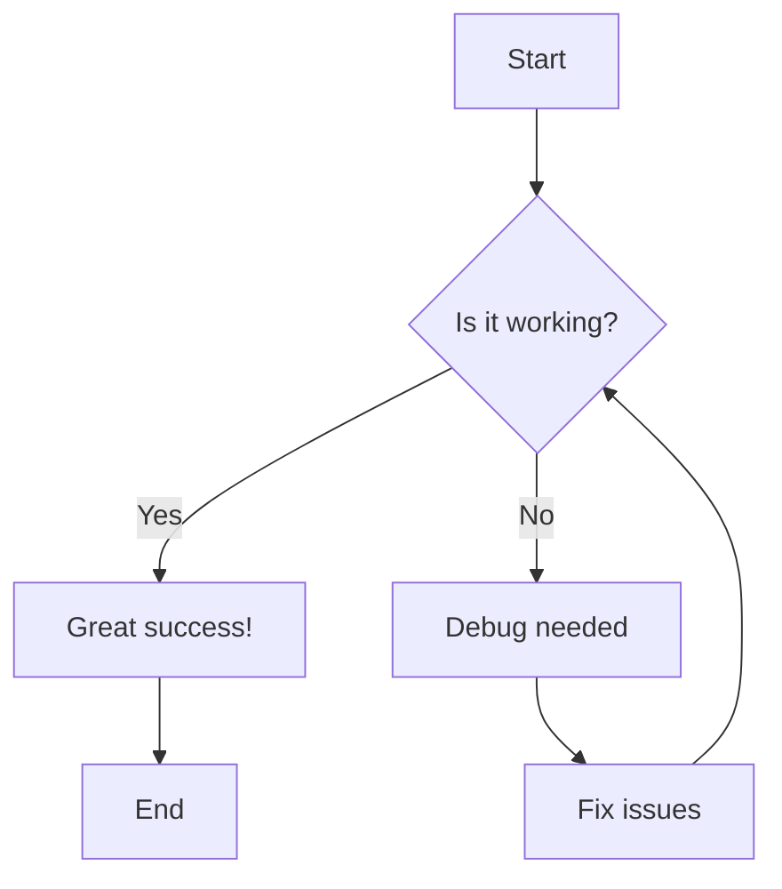
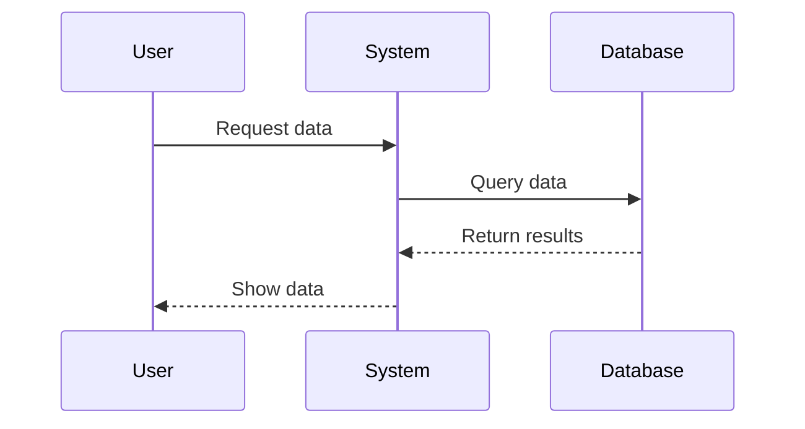

# Test Document with Mermaid

Here's a simple flowchart:

```mermaid
graph TD
    A[Start] --> B{Is it working?}
    B -->|Yes| C[Great success!]
    B -->|No| D[Debug needed]
    C --> E[End]
    D --> F[Fix issues]
    F --> B
```

And a sequence diagram:

```mermaid
sequenceDiagram
    participant User
    participant System
    participant Database
    
    User->>System: Request data
    System->>Database: Query data
    Database-->>System: Return results
    System-->>User: Show data
```

That's all!
